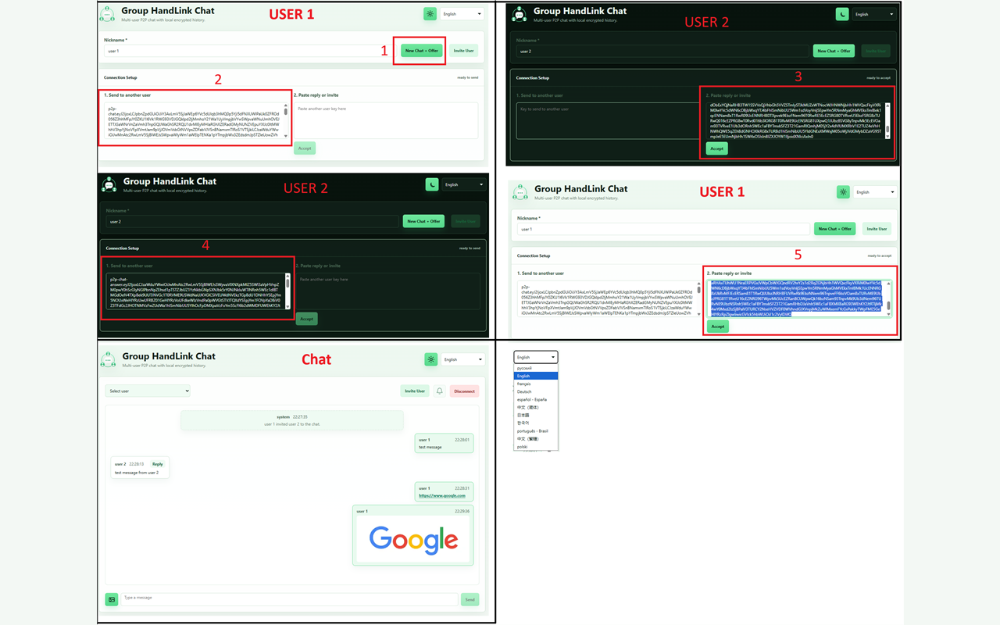

# Group HandLink Chat

Version: `0.1.0`

A browser extension for manual encrypted P2P chat between multiple users without a dedicated backend server.



## Features

- Manual creation of a new chat through `invite + offer`.
- Joining with an incoming `invite + offer` and sending an `answer` back to the inviter.
- Inviting new users into an already active chat.
- Group message exchange over WebRTC DataChannel.
- Mesh/relay exchange between connected participants, so a chain like `user 1 -> user 2 -> user 3` can synchronize messages.
- Payload encryption with the shared room secret from the invite.
- Local message history in IndexedDB, up to the latest 1000 messages per chat.
- Restoration of the last room, nickname, and history after reloading the extension page.
- Required nickname before creating invites or sending messages.
- User mentions through a dropdown list, unread mention highlighting, and a bell indicator.
- Sound notification for a new incoming mention.
- Sending one image in a message from a file or clipboard.
- Image compression to `1280px` on the longest side and saving as `image/webp`.
- Image transfer and storage inside the message as a base64/data URL.
- Clickable links in message text for `http://`, `https://`, and `www.*`.
- Chunk transfer for large encrypted payloads, so history and image messages do not break the DataChannel.
- Light and dark themes.
- Interface localization for multiple languages.

## How Connection Works

1. The first user enters a nickname and clicks `New Chat + Offer`.
2. The extension generates a key to send to another user.
3. The second user pastes this key into the accept field and clicks `Accept`.
4. The second user sends the generated answer back to the first user.
5. The first user pastes the answer and accepts it.
6. After the WebRTC channel opens, the chat window appears.

To add another participant, a connected user clicks `Invite User`, sends the new key to the third user, and accepts that user's answer in the same manual way.

## Messages

- Text messages are synchronized between participants and stored locally.
- Links in text are displayed as clickable links, but remain plain text in history.
- An image can be selected with the button next to the input field or pasted from the clipboard.
- Supported formats: `PNG`, `JPEG`, and `WebP`.
- One image is supported per message.
- If the image is larger than `1.5 MB` after compression, sending is blocked with an error.

## Limitations

- Signaling is manual: users exchange `invite + offer` and `answer` with each other themselves.
- There is no built-in public discovery.
- NAT traversal uses Google's public STUN server: `stun:stun.l.google.com:19302`.
- History is stored locally in the user's browser, not on a server.
- Disconnecting from a chat clears local messages for the current room.

## Development

Install dependencies:

```bash
npm install
```

Run the dev server:

```bash
npm run dev
```

Run TypeScript checks:

```bash
npm run typecheck
```

Run tests:

```bash
npm test
```

Build for production:

```bash
npm run build
```

The built extension is generated in `dist/`.

## Loading In Chrome

1. Run `npm run build`.
2. Open `chrome://extensions`.
3. Enable Developer mode.
4. Click `Load unpacked`.
5. Select the `dist` folder.

After rebuilding, reload the extension on `chrome://extensions`, especially if the background/offscreen runtime changed.

## Main Files

- `src/extension/popup.tsx` - extension UI.
- `src/extension/offscreen.ts` - chat runtime state, history, and notification sound.
- `src/extension/background.ts` - offscreen document startup and UI opening.
- `src/core/trackerChat.ts` - WebRTC session, encrypted payloads, mesh/relay, and chunk transfer.
- `src/core/storage.ts` - IndexedDB through Dexie.
- `src/extension/manifest.json` - Chrome extension manifest.
